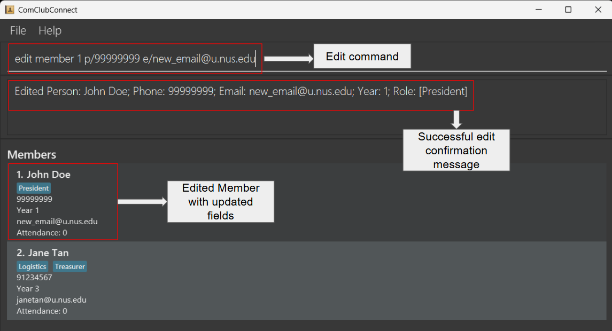
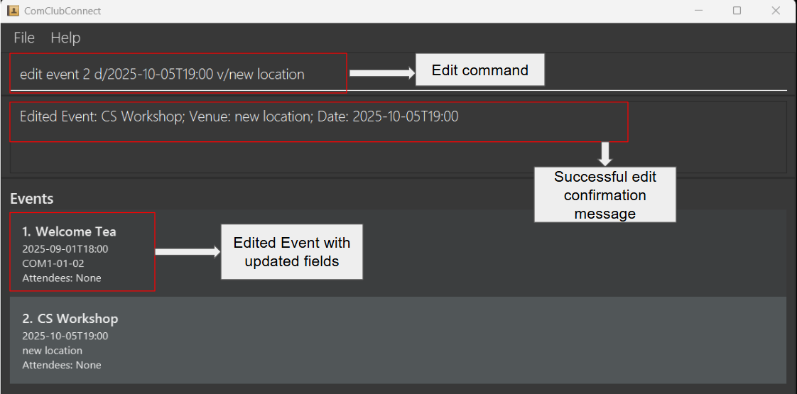
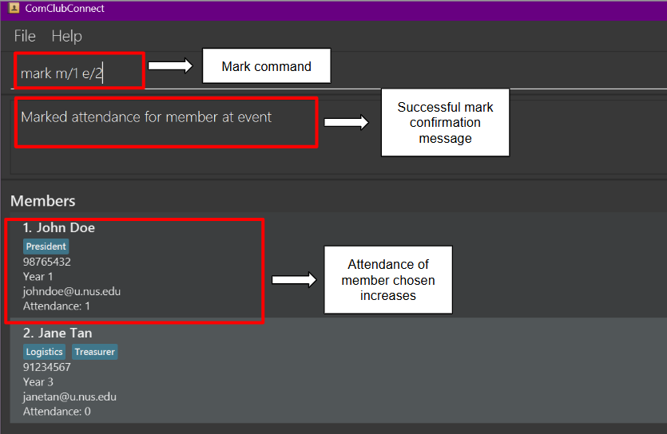
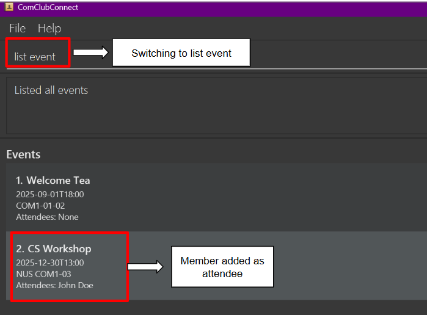
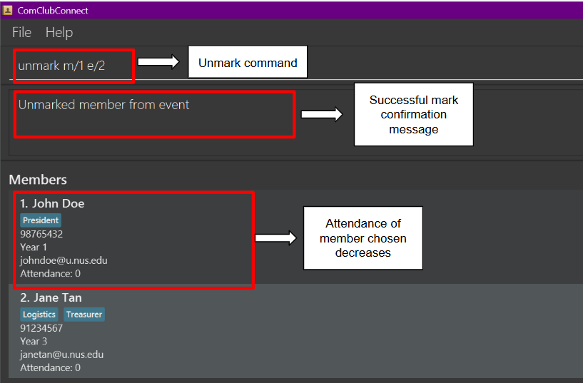
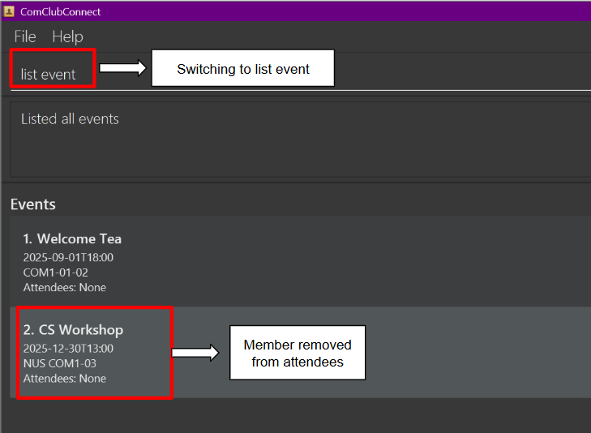

    <strong>Quick Links</strong>
    <ul>
        <li><a href="#about-this-guide">About This Guide</a></li>
        <li><a href="#how-to-use-this-guide">How To Use This Guide</a></li>
        <li><a href="#quick-start">Quick Start</a></li>
        <li><a href="#quick-cli-tutorial">Quick CLI Tutorial</a></li>
        <li>
            <a href="#features">Features</a>
            <ul>
                <li><a href="#viewing-help--help">Viewing Help</a></li>
                <li><a href="#adding-entries--add">Adding Entries</a></li>
                <li><a href="#listing-entries--list">Listing Entries</a></li>
                <li><a href="#editing-entries--edit">Editing Entries</a></li>
                <li><a href="#finding-entries--find">Finding Entries</a></li>
                <li><a href="#deleting-entries--delete">Deleting Entries</a></li>
                <li><a href="#clearing-entries--clear">Clearing Entries</a></li>
                <li><a href="##aliasing-commands--alias">Aliasing Commands</a></li>
                <li><a href="#marking-attendance--mark">Marking Attendance</a></li>
                <li><a href="#unmarking-attendance--unmark">Unmarking Attendance</a></li>
                <li><a href="#unaliasing-commands--unalias">Unaliasing Commands</a></li>
                <li><a href="#exiting--exit">Exiting</a></li>
            </ul>
        </li> 
        <li><a href="#sample-data-on-first-run">Sample Data on First Run</a></li>
        <li><a href="#saving-your-data">Saving Your Data</a></li>
        <li><a href="#editing-the-data-file-advanced">Editing the Data File</a></li>
        <li><a href="#faq">FAQ</a></li>
        <li><a href="#troubleshooting">Troubleshooting</a></li>
        <li><a href="#known-issues">Known Issues</a></li>
        <li><a href="#command-summary">Command Summary</a></li>
    </ul>

ComClubConnect is a desktop application designed for **NUS CCA leaders** that helps you **manage members, plan events and communicate updates** more efficiently than traditional spreadsheet tools or GUI-only applications.

It is optimised for use via a **Command Line Interface (CLI)** while retaining an **intuitive Graphical User Interface (GUI)**.

---

## Table of Contents
- [About This Guide](#about-this-guide)
- [How To Use This Guide](#how-to-use-this-guide)
- [Quick Start](#quick-start)
- [Quick CLI Tutorial](#quick-cli-tutorial)
- [Features](#features)
    - [Viewing Help — `help`](#viewing-help--help)
    - [Adding Entries — `add`](#adding-entries--add)
    - [Listing Entries — `list`](#listing-entries--list)
    - [Editing Entries — `edit`](#editing-entries--edit)
    - [Finding Entries — `find`](#finding-entries--find)
    - [Deleting Entries — `delete`](#deleting-entries--delete)
    - [Clearing Entries — `clear`](#clearing-entries--clear)
    - [Aliasing Commands — `alias`](#aliasing-commands--alias)
    - [Marking Attendance — `mark`](#marking-attendance--mark)
    - [Unmarking Attendance — `unmark`](#unmarking-attendance--unmark)
    - [Unaliasing Commands — `unalias`](#unaliasing-commands--unalias)
    - [Exiting — `exit`](#exiting--exit)
- [Sample Data on First Run](#sample-data-on-first-run)
- [Saving Your Data](#saving-your-data)
- [Editing the Data File (Advanced)](#editing-the-data-file-advanced)
- [FAQ](#faq)
- [Troubleshooting](#troubleshooting)
- [Known Issues](#known-issues)
- [Command Summary](#command-summary)

--------------------------------------------------------------------------------------------------------------------

## About This Guide

This guide is for NUS CCA leaders like you who want to keep track of members, plan events, and handle routine admin tasks quickly and easily using a keyboard-first workflow.

**What you should know before starting:**
- You should be comfortable using a command-line interface on Windows, macOS, or Linux.
- You should know how to copy and paste commands, and edit plain text files.
- You should be familiar with CCA operations, including roles, member lists, and event details such as dates, times, and venues.

[Back to table of contents](#table-of-contents)

--------------------------------------------------------------------------------------------------------------------
## How to use this guide
- [Quick Start](#quick-start): Learn how to open the app and try basic example commands.
- [Features](#features): Learn what each command does, how to use it step by step, and get examples and helpful tips.
- [Troubleshooting & FAQ](#faq): Find answers to common problems and questions you might have.

[Back to table of contents](#table-of-contents)

--------------------------------------------------------------------------------------------------------------------

<h2 id = "quick-start" style="margin-bottom: 0.2em;">Quick Start</h2>

<h3 style="margin-top: 0.3em;">Step 1: Ensure you have Java 17 installed on your computer.</h3>
**Checking your Java version:**
- Open a command terminal
    - **Windows users**: Press Windows + R, type cmd, and press Enter
    - **Mac users**: Open Terminal from Spotlight (press ⌘ + Space, type Terminal)
    - **Linux users**: Open Terminal from your applications menu
- Type `java -version` and press Enter
- If Java is installed, you'll see the version number (e.g., `java version "17.0.1"`)
- The first number should be 17

**If Java is not installed or the version is below 17:**
- Download and install Java 17 by following the guide:
    - [for Windows users](https://se-education.org/guides/tutorials/javaInstallationWindows.html)
    - [for Mac users](https://se-education.org/guides/tutorials/javaInstallationMac.html)
    - [for Linux users](https://se-education.org/guides/tutorials/javaInstallationLinux.html)
- After installation, restart your terminal and repeat the above steps to verify the version again

<h3 style="margin-top: 0.3em;">Step 2: Download ComClubConnect</h3>
Download the latest `.jar` file from [here](https://github.com/AY2526S1-CS2103T-T09-2/tp/releases).

<h3 style="margin-top: 0.3em;">Step 3: Place the file in a folder</h3>
- Your app comes in a single file that ends with .jar (for example, addressbook.jar). You’ll need to decide where you want to keep this file — this will be your ComClubConnect home folder.
    - Find your downloaded `.jar` file (for example, in your Downloads folder).
    - Right-click the file and choose Copy.
    - Go to your preferred folder where you want to keep the file
    - Right-click an empty space and select Paste.

<h3 style="margin-top: 0.3em;">Step 4: Run the application</h3>
- Copy the pathname of the ComCLubConnect home folder
    - **Windows users**: Right click on the folder and select "Copy as path"
    - **Mac users**: Right click on the folder and select "Copy as pathname"
    - **Linux users**: Right click on the folder and select "Copy path"
- Open a command terminal as mentioned in step 2
- Type `cd <copied filepath>` command to enter the folder
- Type `java -jar addressbook.jar` command to run the application. 
- A GUI like the one below will appear on your screen in a few seconds. Note that the app contains some sample data. The layout is explained below. 

[Back to table of contents](#table-of-contents)

--------------------------------------------------------------------------------------------------------------------

## Quick CLI Tutorial

- Click the command input box (top of the UI), type a command exactly as shown (prefixes like `n/`, `p/`, `e/`, `y/`, `r/`, `d/`, `v/` are required), then press **Enter**.

    - Typical response types:
        - **Success message** with brief summary (e.g., “New event added: …”).
        - **List output** after `list` or `find`, showing matching member or event entries.
        - **Error message** beginning with “Invalid command format!” or a validation message — read it carefully and retry.

- Example sequence:

    1. `add member n/John Doe p/98765432 e/johndoe@u.nus.edu y/1 r/President`
        - Expected output: “New person added: John Doe …”
    2. `list member`
        - Expected output: member list including “John Doe”.
    3. `find event n/Welcome`
        - Expected output: a filtered event list containing events with “Welcome” in the name.

- Some example commands you can try:

    * `help` : Shows the help window that provides a link to the User Guide, as well as an optional guided tour.
    * `list member` : Lists all members.
    * `list event` : Lists all events.
    * `add member n/John Doe p/98765432 e/johndoe@u.nus.edu y/1 r/President` : Adds a member named John Doe.
    * `add event n/Welcome Tea d/2025-09-01T18:00 l/COM1-01-02` : Adds an event named Welcome Tea.
    * `mark m/1 e/1` : Marks attendance for member 1 (John Doe) for event 1 (Welcome Tea).
    * `unmark m/1 e/2` : Removes attendance for member 1 (John Doe) for event 1 (Welcome Tea).
    * `delete member 3` : Deletes the 3rd member shown in the current list.
    * `clear event` : Deletes all events.
    * `exit` : Exits the app.

- For more details on the commands, see [Features](#features).

[Back to table of contents](#table-of-contents)

--------------------------------------------------------------------------------------------------------------------

## Features

**Notes on command format**
- Some commands require a `TYPE` immediately after the command word: `member` or `event` (e.g., `add member`, `list event`).
- Words in `UPPER_CASE` are parameters you supply. For example, in `add member n/NAME`, `NAME` can be `John Doe`.
- Items in square brackets are optional.
  e.g `n/NAME [r/ROLE]` can be used as `n/John Doe r/President` or as `n/John Doe`.
- Items with …​ after them can be used multiple times including zero times.
  e.g. `[r/ROLE]…`​ can be used as   (i.e. 0 times), `r/President`, `r/President r/Alumni` etc.
- Parameters must follow the order for all commands except for `mark` and `unmark`.
- Command words and prefixes are case-sensitive
- Leading and trailing spaces around the entire command, `TYPE` and each parameter value are ignored
- Internal spaces are kept as typed unless a field forbids spaces (e.g. phone numbers must not contain internal spaces)

**Member field constraints**

<table>
  <thead>
    <tr>
      <th>Field</th>
      <th>Constraints</th>
    </tr>
  </thead>
  <tbody>
    <tr>
      <td><strong>NAME (`n/`)</strong></td>
      <td>- Alphanumeric and spaces only   - Extra internal spaces (i.e. more than one) will be allowed for input but removed when stored   - Input must be at most 35 characters (including spaces)</td>
    </tr>
    <tr>
      <td><strong>PHONE (`p/`)</strong></td>
      <td>- Must not be blank   - Digits only   - Exactly 8 digits   - Must start with 8 or 9   - Must not contain spaces between the digits</td>
    </tr>
    <tr>
      <td><strong>EMAIL (`e/`)</strong></td>
      <td>- Must not be blank   - Must be of the format `local-part@u.nus.edu`   - `local-part` should only contain alphanumeric characters and these special characters `+_.-`. It should also not start or end with any of such special characters   - The domain must be exactly '@u.nus.edu'   - Input must be at most 35 characters (including spaces)</td>
    </tr>
    <tr>
      <td><strong>YEAR (`y/`)</strong></td>
      <td>- Must not be blank   - Only be `1`, `2`, `3`, or `4`</td>
    </tr>
    <tr>
      <td><strong>ROLE (`r/`)</strong></td>
      <td>- At least one role is required i.e. must not be blank   - Each role is a single alphanumeric word with no internal spaces   - To add additonal roles, use `r/` prefix again before the additional role   - Input must be at most 35 characters (including spaces)</td>
    </tr>
  </tbody>
</table>

**Event field constraints**

<table>
  <thead>
    <tr>
      <th>Field</th>
      <th>Constraints</th>
    </tr>
  </thead>
  <tbody>
    <tr>
      <td><strong>NAME (`n/`)</strong></td>
      <td>- Alphanumeric and spaces only   - Extra internal spaces will be allowed for input but removed when stored   - Input must be at most 35 characters (including spaces)</td>
    </tr>
    <tr>
      <td><strong>DATE_TIME (`d/`)</strong></td>
      <td>- Should be in ISO format (no seconds) `YYYY-MM-DDThh:mm`</td>
    </tr>
    <tr>
      <td><strong>VENUE (`v/`)</strong></td>
      <td>- Must not be blank   - Input must be at most 75 characters (including spaces)</td>
    </tr>
  </tbody>
</table>

⚠️ <strong>Caution:</strong> If you are using a PDF version, commands that wrap across lines may lose spaces when copied — retype if needed.

### Viewing Help — `help`

Need help? You can copy the user guide link or click the green button to explore the guided tour.

Format: `help`

#### Guided Tour

This is an interactive walkthrough that helps you get to know the app. It highlights key components of our application— with color cues and in-depth explanations.

✅ <strong>Tip: </strong> You can use the <code>F1</code> key or the Help menu to open the Help window quickly.

⚠️ <strong>Caution:</strong> If the Help window is minimized, running <code>help</code> again will not open a new window. You should restore the minimized window instead.

[Back to table of contents](#table-of-contents)

### Adding Entries — `add`

You can add a new member or event to your list.

**To add members:**

Format: `add member n/NAME p/PHONE e/EMAIL y/YEAR r/ROLE [r/ROLE]…`

- You cannot add duplicate members. See FAQ for notes on what constitutes a [duplicate member](#duplicate-members)
- For field constraints: see [Member field constraints](#member-constraints)

Examples:
- `add member n/John Doe p/98765432 e/johndoe@u.nus.edu y/1 r/President`
→ Adds John Doe with phone 98765432, email johndoe@u.nus.edu, year 1, role President.

- `add member n/Jane Tan p/91234567 e/janetan@u.nus.edu y/3 r/Treasurer r/Logistics`
→ Adds Jane Tan with phone 91234567, email janetan@u.nus.edu, year 3, roles Treasurer and Logistics.

**To add events:**

- Format: `add event n/NAME d/DATE_TIME v/VENUE`

- You cannot add duplicate events. See FAQ for notes on what constitutes a [duplicate event](#duplicate-events)
- For field constraints: see [Event field constraints](#event-constraints)

Examples:
- `add event n/Welcome Tea d/2025-09-01T18:00 v/COM1-01-02`
→ Creates “Welcome Tea” on 2025-09-01 18:00 at COM1-01-02.

✅ <strong>Tip:</strong> Since roles are a single alphanumeric word and cannot contain spaces, consider using CamelCase (e.g. <code>r/TechLead</code>).

⚠️ <strong>Caution:</strong> All required prefixes must appear exactly once: <code>n/</code>, <code>p/</code>, <code>e/</code>, <code>y/</code> (member) and <code>n/</code>, <code>d/</code>, <code>v/</code> (event). Only <code>r/</code> may repeat, and at least one <code>r/</code> is required.

[Back to table of contents](#table-of-contents)

### Listing Entries — `list`

You can view the entire current list of members or events.
Both lists show entries in the order they were added (i.e. newest at the bottom).

Format: `list TYPE`

- `TYPE` is either `member` or `event`.

Examples:
- `list member`
→ Shows all members (resets any filters).

- `list event`
→ Shows all events (resets any filters).

✅ <strong>Tip:</strong> Running this command resets any previous filters and shows the full list again.

⚠️ <strong>Caution:</strong> Extra inputs after <code>list TYPE</code> are not allowed (e.g., <code>list member now</code> is invalid).

[Back to table of contents](#table-of-contents)

### Editing Entries — `edit`

You can use the edit command to update details of an existing member or event in your list.

**To edit members:**

Format: `edit member INDEX [n/NAME] [p/PHONE] [e/EMAIL] [y/YEAR] [r/ROLE]…`

- You choose which member to edit by specifying their `INDEX` (the first member is 1).
- You must include at least one field to edit - for example, a name, phone number, or email.
- Each field prefix (like n/, p/, e/, y/, r/) can be used only once in a single command.
- If you add one or more r/ROLE values, all previous roles will be replaced with the new ones.
- You cannot edit a member to create a duplicate. See FAQ for notes on what constitutes a [duplicate member](#duplicate-members)
- For field constraints: see [Member field constraints](#member-constraints)

Examples:
- `edit member 2 n/Betsy Crower` 
→ This command changes the name of the second member in your list to Betsy Crower, while keeping all other details (like phone number, email, etc.) the same.

- `edit member 1 p/91234567 e/johndoe@u.nus.edu`
→ This updates the first member’s phone number to 91234567 and email to johndoe@u.nus.edu, keeping everything else unchanged.

**To edit events:**

Format: `edit event INDEX [n/NAME] [d/DATE_TIME] [v/VENUE]`

- You choose which event to edit by specifying its INDEX (the first member is 1).
- You must include at least one field to change — such as the event name, date/time, or venue.
- Each prefix (n/, d/, v/) can only be used once per command.
- You cannot edit an event to create a duplicate. See FAQ for notes on what constitutes a [duplicate event](#duplicate-events)
- For field constraints: see [Event field constraints](#event-constraints)

Examples:
- `edit event 1 n/Welcome`
→ This renames the first event in your list to “Welcome” while keeping the date/time and venue the same.

- `edit event 2 d/2025-10-05T19:00 v/COM3-01-12`
→ This updates the second event’s date/time to 5 October 2025, 7:00 PM, and changes the venue to COM3-01-12.

✅ <strong>Tip:</strong> You can edit multiple fields in one command, e.g., <code>edit member 3 n/New Name p/91234567</code>.

⚠️ <strong>Caution:</strong> The <code>INDEX</code> refers to the currently displayed list. Your currently displayed list could be a filtered list (i.e. Filtered list is a result of a `find` command)!

[Back to table of contents](#table-of-contents)

### Finding Entries — `find`

Finds members or events matching the given criteria. Matching is case-insensitive and by whole words.

**Members:**

Find your members by **either** member's name **or** member's year of study but **not both**.

Format: `find member n/KEYWORDS…` (Find by member name)  **or** `find member y/KEYWORDS…` (Find by member year of study)

Examples:
- `find member n/Alex`
→ This shows you all members whose **name** contains “Alex”.

- `find member y/1`
→ This shows you all members in **year 1**.

**Events:**

Find your events by **either** event's name **or** event's venue but **not both**.

Format: `find event n/KEYWORDS…` (Find by event name) **or** `find event v/KEYWORDS…` (Find by event venue)

Examples:
- `find event n/Graduation`
→ This shows you all events whose **name** includes “Graduation”.

- `find event v/COM1`
→ This shows you all events held at the **venue** “COM1”.

✅ <strong>Tip:</strong> Enter multiple keywords to widen your search results, e.g., <code>find member n/Alex David</code> will show all members whose names contain either “Alex” or “David”. 

⚠️ <strong>Caution:</strong> The list that will be used will be filtered list. You can <code>edit</code> or <code>delete</code> by using index from the <strong>filtered list</strong>. To <code>edit</code> or <code>delete</code> other entries, <code>list TYPE</code>before proceeding.

[Back to table of contents](#table-of-contents)

### Deleting Entries — `delete`

You can use the `delete` command to remove a **member** or an **event** from your list.

Format: `delete TYPE INDEX`

- `TYPE` is either `member` or `event`.
- `INDEX` refers to the index number shown in the current list and must be a positive number.

Examples:
- `delete member 2`
→ This removes the second member in your current list.

- `delete event 1`
→ This removes the first event in your current list.

✅ <strong>Tip:</strong> Use <code>list member</code> or <code>list event</code> just before deleting to avoid index confusion.

⚠️ <strong>Caution:</strong> Deletions cannot be undone. Double-check the index before confirming.

[Back to table of contents](#table-of-contents)

### Clearing Entries — `clear`

Clears all members or all events.

Format: `clear TYPE`

- `TYPE` is either `member` or `event`.

Examples:
- `clear member`
→ Removes all members.

- `clear event`
→ Removes all events.

⚠️ <strong>Caution:</strong> This action deletes all entries of the chosen type. It cannot be undone.

[Back to table of contents](#table-of-contents)

### Aliasing Commands — `alias`

Create a custom alias for any command word for your greater convenience.

Format: `alias COMMAND_WORD ALIAS`

- Supported `COMMAND_WORD`s: `add`, `edit`, `delete`, `clear`, `find`, `list`, `help`, `exit`, `alias`, `unalias`, `mark`, `unmark`.
- `ALIAS` must be a single word, not a built-in command word and not an existing `ALIAS`.
- To view your stored aliases, enter `alias` with **no keywords**.

Examples:
- `alias delete rm` — After this, `rm member 1` works like `delete member 1`.
- `alias list ls`
- `alias` - Your stored aliases will be displayed.

✅ <strong>Tip:</strong> Choose aliases that mirror your team’s habits and keep it short for easier recall, e.g., <code>rm</code> for <code>delete</code>.

[Back to table of contents](#table-of-contents)

### Marking Attendance — `mark`

You can add a member's attendance to an event. Their attendance increases by 1 and they are added to the event’s attendees list.

Format: `mark m/MEMBER_INDEX e/EVENT_INDEX` or `mark e/EVENT_INDEX m/MEMBER_INDEX`

- `MEMBER_INDEX` and `EVENT_INDEX` (both 1-based) refer to the index numbers shown in their respective currently displayed lists.
- Both pararmeters are required exactly once: `m/` (member index) and `e/` (event index).
- A member already marked for an event cannot be marked again.

Examples:

- `mark m/1 e/2`
→ Marks member at current member index 1 as attending event at current event index 2

⚠️ <strong>Caution:</strong> The <code>INDEX</code> refers to the currently displayed list. Your currently displayed list could be a filtered list (i.e. Filtered list is a result of a `find` command)!

[Back to table of contents](#table-of-contents)

### Unmarking Attendance — `unmark`

You can remove a member's attendance from an event. Their attendance decreases by 1 and they are removed from the event’s attendees list.

Format: `unmark m/MEMBER_INDEX e/EVENT_INDEX` or `unmark e/EVENT_INDEX m/MEMBER_INDEX`

- `MEMBER_INDEX` and `EVENT_INDEX` refer to the index numbers shown in their respective currently displayed lists and must be positive integers.
- Both parameters are required exactly once: `m/` (member index) and `e/` (event index).
- You can only unmark if the member is currently marked for that event.

Examples:

- `unmark m/1 e/2`
→ Unmarks member at current member index 1 as attending event at current event index 2

✅ <strong>Tip:</strong> If unsure whether a member is marked for an event, unmarking will tell you if there is nothing to unmark. Use <code>list member</code> and <code>list event</code> to verify indices first.

⚠️ <strong>Caution:</strong> The <code>INDEX</code> refers to the currently displayed list. Your currently displayed list could be a filtered list (i.e. Filtered list is a result of a `find` command)!
>

[Back to table of contents](#table-of-contents)

### Unaliasing Commands — `unalias`

Remove an existing alias for a command word

Format: `unalias COMMAND_WORD`

- Supported `COMMAND_WORD`s: `add`, `edit`, `delete`, `clear`, `find`, `list`, `help`, `exit`, `alias`, `unalias`, `mark`, `unmark`.
- Enter only **one** `COMMAND_WORD`. 
- To remove **all** aliases, enter `all` as the `COMMAND_WORD`.

Examples:

- `unalias delete`
- `unalias all`

✅ <strong>Tip:</strong> To replace an existing alias for a command word, simply <code>alias NEW_ALIAS_WORD COMMAND_WORD</code> instead of <code>unalias COMMAND_WORD</code> followed by <code>alias NEW_ALIAS_WORD COMMAND_WORD</code>.

[Back to table of contents](#table-of-contents)

### Exiting — `exit`

You can exit the program.

Format: `exit`

[Back to table of contents](#table-of-contents)

--------------------------------------------------------------------------------------------------------------------

## Sample Data on First Run

If you don’t have existing data files, the app starts with a small set of sample entries so you can try commands immediately.

- Sample members (name — phone — email — year — roles):
  - Alex Yeoh — 87438807 — alexyeoh@u.nus.edu — Year 1 — VicePresident
  - Bernice Yu — 99272758 — berniceyu@u.nus.edu — Year 2 — OperationsHead, Treasurer
  - Charlotte Oliveiro — 93210283 — charlotte@u.nus.edu — Year 3 — MarketingHead
  - David Li — 91031282 — lidavid@u.nus.edu — Year 4 — President
  - Irfan Ibrahim — 92492021 — irfan@u.nus.edu — Year 1 — Member
  - Roy Balakrishnan — 92624417 — royb@u.nus.edu — Year 2 — Secretriat

- Sample aliases (available only if no alias data exists yet):
  - delete → d
  - add → a
  - list → l

Note:
- Once you save your own data, subsequent runs will load your saved data instead of the samples.

[Back to table of contents](#table-of-contents)

--------------------------------------------------------------------------------------------------------------------

## Saving Your Data

Data is saved to disk automatically after any command that changes data. No manual save is needed.

[Back to table of contents](#table-of-contents)

--------------------------------------------------------------------------------------------------------------------

## Editing the Data File (Advanced)

Data is saved as a JSON file at `[JAR file location]/data/addressbook.json`.

⚠️ <strong>Caution:</strong> If the JSON format becomes invalid, the app will start with an empty data file on the next run. Make a backup first. Invalid values (e.g., non-<code>@u.nus.edu</code> emails or malformed dates) may cause unexpected behavior.

[Back to table of contents](#table-of-contents)

--------------------------------------------------------------------------------------------------------------------

## FAQ

- Are duplicate members allowed?
- No. Two members with the same name are considered duplicates. Name matching is case-insensitive and ignores extra (i.e. more than one) internal spaces.
  Examples:
    - `John DoE` and `john doe` → duplicate
    - `Jane  Doe` and `jane doe` → duplicate

- Are duplicate events allowed?
- No. Two events with the same name and the same date are considered duplicates. Name matching is case-insensitive and ignores extra (i.e. more than one) internal spaces.
  Examples:
    - `Welcome  TeA` on `2025-09-01T18:00` and `welcome tea` on `2025-09-01T18:00` → duplicate

- Can I import my existing member list from Excel/Google Sheets?
- Not directly. You can copy key details and add members using `add member ...`. Power users can transform CSV to match `addressbook.json`, but be careful with format.

- Why does my email keep getting rejected?
- Emails must end with `@u.nus.edu` and have a valid local-part (alphanumeric plus `+ _ . -`, not starting/ending with a special character).

- What phone numbers are allowed?
- Exactly 8 digits, starting with `8` or `9`, and no spaces.

- How do I record multiple roles for a member?
- Repeat the `r/` prefix, e.g., `r/President r/TechLead`. Roles are alphanumeric and cannot contain spaces.

- Can I search by role or by event date range?
- Role-based search and date-range filters are not supported currently. You can search members by name or year, and events by name or location.

- I entered `2025-09-01 18:00` but got an invalid date. Why?
- Use ISO format with `T` between date and time: `2025-09-01T18:00`.

- I deleted the wrong person/event. Can I undo?
- Undo is not available. Consider exporting a backup (`data/addressbook.json`) periodically.

- How do I move my data to another computer?
- Copy your `addressbook.json` from the `data` folder next to your `.jar` into the same location on the new machine before running the app there.

- The app says it can’t save due to permissions. What should I do?
- Move the `.jar` file to a folder you have write access to (e.g., your home folder or desktop) and run it again.

- Can multiple EXCO members use the same data file?
- Yes. Share the `addressbook.json` file via a cloud drive, but ensure only one person runs the app and edits the file at a time to avoid conflicts.

[Back to table of contents](#table-of-contents)

--------------------------------------------------------------------------------------------------------------------

## Troubleshooting

Problem: “Invalid command format!”
- Reason: Missing required parts or extra unexpected text.
- Solution: Compare with the command’s “Format” in this guide; remove extras and include all required prefixes.

Problem: “Phone number must be exactly 8 digits and start with 8 or 9.”
- Reason: The number contains spaces, wrong length, or starts with other digits.
- Solution: Enter an 8-digit number starting with 8 or 9, with no spaces.

Problem: “Emails should be of the format local-part@u.nus.edu …”
- Reason: Email is not an NUS email or local-part is invalid.
- Solution: Use a valid NUS email like `alexlee@u.nus.edu`.

Problem: “Dates should be in ISO format YYYY-MM-DDTHH:MM”
- Reason: Missing the `T` separator or wrong format.
- Solution: Enter `YYYY-MM-DDTHH:MM` (e.g., `2025-10-05T19:00`).

Problem: “Member is already marked for attendance at this event”
- Reason: Duplicate attendance.
- Solution: No action needed or use `unmark m/<MEMBER_INDEX> e/<EVENT_INDEX>` first.

Problem: “Member is not marked at this event”
- Reason: Nothing to unmark for the chosen member/event.
- Solution: Verify indices (use `list member` and `list event`) and then `mark` if needed.

Problem: “Unknown command”
- Reason: Typos or using a command that does not exist.
- Solution: Run `help` to see supported commands. Consider creating an alias for frequently used commands.

Problem: “Could not save data due to insufficient permissions …”
- Reason: The current folder is read-only.
- Solution: Move the `.jar` to a writable folder and run it again.

[Back to table of contents](#table-of-contents)

--------------------------------------------------------------------------------------------------------------------

## Known Issues

1. When using multiple screens, if you move the application to a secondary screen, and later switch to only the primary screen, the GUI may open off-screen. Remedy: delete `preferences.json` in the app folder and start again.
2. If you minimize the Help window and run `help` again, the original Help window remains minimized and no new Help window appears. Remedy: restore the minimized Help window.

[Back to table of contents](#table-of-contents)

--------------------------------------------------------------------------------------------------------------------

## Command Summary

    <table class="command-summary">
    <thead>
    <tr>
    <th style="width: 20%;">Action</th>
    <th style="width: 80%;">Format Examples</th>
    </tr>
    </thead>
    <tbody>
    <tr>
    <td><strong>add</strong></td>
    <td>
    <strong>Member:</strong> <code>add member n/Alex Tan p/91234567 e/alextan@u.nus.edu y/2 r/Logistics</code>
    

    <strong>Event:</strong> <code>add event n/Welcome Tea d/2025-09-01T18:00 v/COM1-01-02</code>
    </td>
    </tr>
    <tr>
    <td><strong>edit</strong></td>
    <td>
    <strong>Member:</strong> <code>edit member 2 e/alextan@u.nus.edu p/98765432</code>
    

    <strong>Event:</strong> <code>edit event 1 d/2025-10-05T19:00 v/COM3-01-12</code>
    </td>
    </tr>
    <tr>
    <td><strong>delete</strong></td>
    <td>
    <strong>Member:</strong> <code>delete member 3</code>
    

    <strong>Event:</strong> <code>delete event 1</code>
    </td>
    </tr>
    <tr>
    <td><strong>list</strong></td>
    <td>
    <strong>Member:</strong> <code>list member</code>
    

    <strong>Event:</strong> <code>list event</code>
    </td>
    </tr>
    <tr>
    <td><strong>find</strong></td>
    <td>
    <strong>Member:</strong> <code>find member n/Alex</code>, <code>find member y/1</code>
    

    <strong>Event:</strong> <code>find event n/Welcome</code>, <code>find event v/COM1</code>
    </td>
    </tr>
    <tr>
    <td><strong>clear</strong></td>
    <td>
    <strong>Member:</strong> <code>clear member</code>
    

    <strong>Event:</strong> <code>clear event</code>
    </td>
    </tr>
    <tr>
    <td><strong>alias</strong></td>
    <td><code>alias delete rm</code>, <code>alias list ls</code>, <code>alias</code></td>
    </tr>
    <tr>
    <td><strong>unalias</strong></td>
    <td><code>unalias delete</code>, <code>unalias all</code></td>
    </tr>
    <tr>
    <td><strong>mark</strong></td>
    <td><code>mark m/1 e/2</code></td>
    </tr>
    <tr>
    <td><strong>unmark</strong></td>
    <td><code>unmark m/1 e/2</code></td>
    </tr>
    <tr>
    <td><strong>help</strong></td>
    <td><code>help</code></td>
    </tr>
    <tr>
    <td><strong>exit</strong></td>
    <td><code>exit</code></td>
    </tr>
    </tbody>
    </table>

[Back to table of contents](#table-of-contents)

