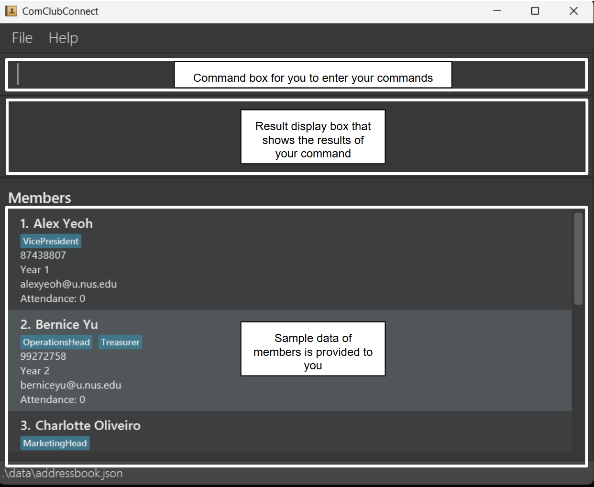

# ComClubConnect User Guide

ComClubConnect is a desktop app for <b>NUS CCA leaders</b> to <b>manage members and events</b>, optimised for use via a Command Line Interface (CLI) while still having an intuitive Graphical User Interface (GUI). If you are a fast typer, ComClubConnect helps you track members, plan events, and communicate changes faster than traditional spreadsheets or GUI-only apps.

* Table of Contents
  {:toc}

<strong>Quick Links</strong>

- [Quick Start](#quick-start)
- [About This Guide](#about-this-guide)
- [Features](#features)
- [Command Summary](#command-summary)
- [FAQ](#faq)
- [Troubleshooting](#troubleshooting)

--------------------------------------------------------------------------------------------------------------------

## About This Guide

This guide is written for NUS CCA leaders who need to maintain member records, plan events, and perform routine admin tasks quickly and accurately using a keyboard-first workflow.

Assumed prior knowledge:
- Comfortable using a command terminal on Windows / macOS / Linux.
- Basic familiarity with copying/pasting commands and editing plain text.
- Understands CCA context (roles, member lists, event details like date/time and venue).

How to use this guide:
- Quick start: run the app and try a few example commands.
- Features: step-by-step usage, command syntax, examples, expected output, tips and cautions.
- Troubleshooting and FAQ: common problems, reasons, and solutions.

[Back to top](#comclubconnect-user-guide)

--------------------------------------------------------------------------------------------------------------------

## Quick Start

1. Ensure you have Java 17 or above installed on your computer. 
> Checking your Java version:
> - Open a command terminal
> - Type `java -version` and press Enter
> - If Java is installed, you'll see the version number (e.g., `java version "17.0.1"`)
> - The first number should be 17
>
> If Java is not installed or the version is below 17:
> - Download and install Java 17 by following the guide:
    >   - [for Windows users](https://se-education.org/guides/tutorials/javaInstallationWindows.html)
>   - [for Mac users](https://se-education.org/guides/tutorials/javaInstallationMac.html)
>   - [for Linux users](https://se-education.org/guides/tutorials/javaInstallationLinux.html)
> - After installation, restart your terminal and verify the version again

2. Download the latest `.jar` file from [here](https://github.com/AY2526S1-CS2103T-T09-3/tp/releases).

3. Copy the `.jar` file to the folder you want to use as the home folder for your ComClubConnect.

4. Open a command terminal, `cd` into the folder you put the `.jar` file in, and use the `java -jar addressbook.jar` command to run the application. 
   A GUI similar to the below should appear in a few seconds. Note that the app contains some sample data and the layout is explained in coloured boxes. 
   

### Quick CLI Tutorial
- Click the command input box (bottom of the UI), type a command exactly as shown (prefixes like `n/`, `p/`, `e/`, `y/`, `r/`, `d/`, `l/` are required), then press Enter.
- Typical response types:
